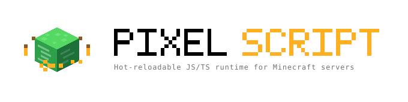
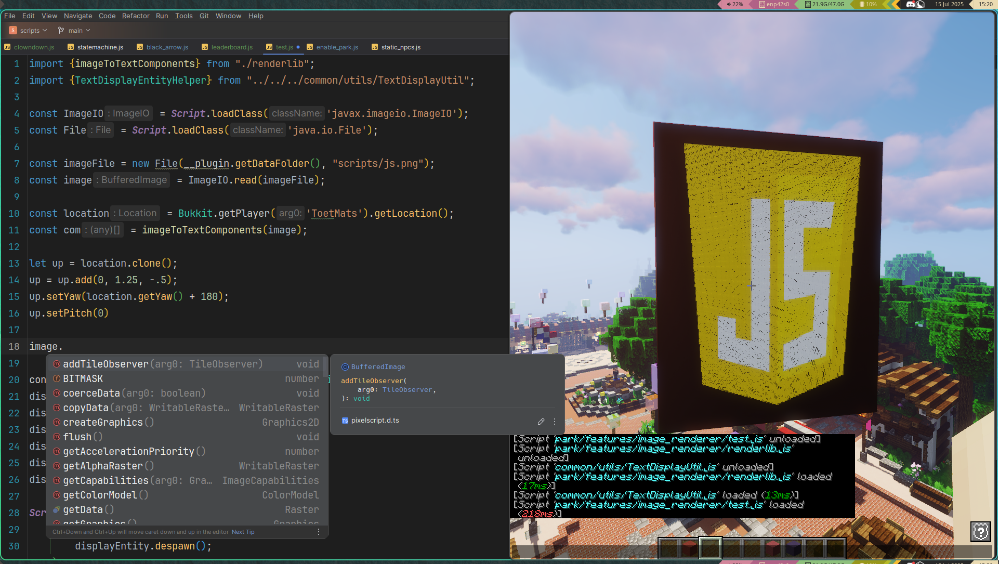

<p align="center">
  <picture>
    <source media="(prefers-color-scheme: dark)" srcset="assets/branding/pixelscript-logo-on-dark.svg">
    
  </picture>
</p>

<p align="center">
  
</p>

<h1 align="center">PixelScript documentation</h1>

<p align="center">
  A hot-reloadable JavaScript and TypeScript runtime for Minecraft servers.<br>
  <a href="https://pixelib.github.io/pixelscript-docs/"><strong>Read the docs &rarr;</strong></a>
</p>

<p align="center">
  <a href="https://pixelib.github.io/pixelscript-docs/ai/">Onboard your AI</a> &middot;
  <a href="https://github.com/pixelib/pixelscript">PixelScript on GitHub</a> &middot;
  <a href="https://license-platform.pixelib.dev/artifacts">Downloads</a>
</p>

---

## What PixelScript is

PixelScript runs your server logic as JavaScript on the JVM, calling the real Bukkit/Paper API. Save a
file and the change is live. No rebuild, no restart, no reconnect.

You are not learning a scripting language. You are writing Java with JavaScript syntax, against the same
API you already know, with the iteration loop of a web app.

```javascript
registerCommand('heal', (sender, args) => {
  if (!sender.hasPermission('server.heal')) {
    sender.sendRichMessage('<red>No permission.</red>');
    return;
  }

  sender.setHealth(20);
  sender.sendRichMessage('<green>Healed.');
});
```

That is a complete feature. Save the file and `/heal` exists. Delete the file and it is gone, unregistered
cleanly, with no restart in either direction.

Commands, event listeners and scheduled tasks are unregistered for you on reload. Everything else you own,
via a single unload callback. Scripts form an explicit tree of reload barriers, so a change to one feature
does not reboot the rest of your server's logic.

## Using an AI assistant

Coding agents already speak JavaScript. What they lack is the runtime: the load tree, the globals, the
threading rules, the cleanup contract. One command fixes that.

From your scripts directory (`plugins/PixelScript/scripts`):

```bash
git clone --depth 1 https://github.com/pixelib/pixelscript-docs .pixelscript-docs \
  && cp .pixelscript-docs/CLAUDE.md ./CLAUDE.md \
  && grep -qxF '.pixelscript-docs/' .gitignore 2>/dev/null || echo '.pixelscript-docs/' >> .gitignore
```

You get [`CLAUDE.md`](CLAUDE.md), a condensed reference to the whole runtime, plus the full documentation
in the workspace for when the agent needs detail. Nothing in `.pixelscript-docs/` is loaded by PixelScript;
the runtime only picks up `.js` and `.ts` files.

Just the reference file, without the docs:

```bash
curl -fsSL https://raw.githubusercontent.com/pixelib/pixelscript-docs/main/CLAUDE.md -o CLAUDE.md
```

Full guide, including other agents and how to add project-specific context:
[Onboard your AI](https://pixelib.github.io/pixelscript-docs/ai/).

## Contents

**Getting started**: [Overview](overview.md) &middot;
[Download](getting-started-001-download.md) &middot;
[How to think about a script](getting-started-002-how-to-think-about-a-script.md)

**Tutorial**: [Work environment](tutorial-001-setting-up-your-work-env.md) &middot;
[Configuration](tutorial-002-configuration.md) &middot;
[Scripts and script management](tutorial-003-scripts.md)

**API reference**: [Script](spec-001-script.md) &middot;
[`$` magic imports](spec-002-magic-imports.md) &middot;
[Modules](spec-003-import-export.md) &middot;
[Bukkit](spec-004-bukkit.md) &middot;
[Commands](spec-005-commands.md) &middot;
[Events](spec-006-events.md) &middot;
[Scheduler](spec-007-scheduler.md) &middot;
[Concurrency](spec-008-threading-model.md) &middot;
[Database](spec-009-database.md) &middot;
[Fetch](spec-010-fetch.md) &middot;
[Console](spec-011-console.md) &middot;
[JSON](spec-012-json.md) &middot;
[Shared state](spec-013-shared-state.md) &middot;
[Java implementations](spec-014-java-implementations.md)

**Tips and tricks**: [Java interop](tips-001-java-interop.md) &middot;
[Interfaces and abstract classes](tips-002-interfaces-and-abstract-classes.md) &middot;
[TypeScript](tips-003-typescript-and-types.md) &middot;
[Profiling](tips-004-performance-profiling.md) &middot;
[Built-in commands](tips-005-built-in-commands.md)

## Contributing

Found a mistake, or something the docs never explained? [Open an issue](https://github.com/pixelib/pixelscript-docs/issues)
or send a pull request. Corrections from people who just hit the problem are the most valuable kind.

House rules for edits:

- Every article carries YAML front matter. `title`, `parent`, `nav_order` and `permalink` drive the site navigation.
- **Do not change an existing `permalink`.** Published URLs should stay stable. Renaming a file is fine; changing where it resolves is not.
- Link between articles with relative `.md` paths (`./spec-001-script.md`). `jekyll-relative-links` rewrites them to permalinks at build time, so the same link works both here on GitHub and on the published site.
- Screenshots go in `assets/img/`.
- No em dashes.

## Building locally

```bash
bundle install
bundle exec jekyll serve
```

The site is served at `http://localhost:4000/pixelscript-docs/`.

Pushing to `main` deploys automatically via [the Pages workflow](.github/workflows/pages.yml).

## License

The documentation in this repository is public. PixelScript itself is commercial software;
see [the main repository](https://github.com/pixelib/pixelscript).
