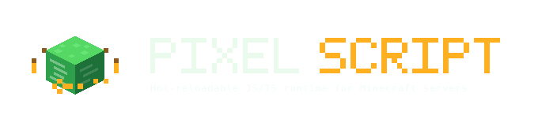

# {: .hero-logo }

{: .fs-6 .fw-300 }
A hot-reloadable JavaScript and TypeScript runtime for Minecraft servers.

{: .site-screenshot }

PixelScript runs your server logic as JavaScript on the JVM, calling the real Bukkit/Paper API. Save a
file and the change is live. No rebuild, no restart, no reconnect.

You are not learning a scripting language. You are writing Java with JavaScript syntax, against the same
API you already know, with the iteration loop of a web app.

```javascript
registerCommand('heal', (sender, args) => {
  if (!sender.hasPermission('server.heal')) {
    sender.sendRichMessage('<red>No permission.</red>');
    return;
  }

  sender.setHealth(20);
  sender.sendRichMessage('<green>Healed.');
});
```

That is a complete, working feature. Save the file and `/heal` exists. Delete the file and it is gone,
unregistered cleanly, with no server restart in either direction.

---

## Start here

<div class="d-flex flex-wrap">
<div markdown="1" style="min-width:16rem;flex:1;padding-right:1.5rem">

### New to PixelScript

1. [Overview](./overview.md), what it is and why
2. [How to think about a script](./getting-started-002-how-to-think-about-a-script.md)
3. [Set up your environment](./tutorial-001-setting-up-your-work-env.md)
4. [Scripts and script management](./tutorial-003-scripts.md)

</div>
<div markdown="1" style="min-width:16rem;flex:1">

### Already running

- [API reference](./api.md)
- [Concurrency model](./spec-008-threading-model.md)
- [Built-in commands](./tips-005-built-in-commands.md)
- [Changelog](./changelog.md)

</div>
</div>

---

## Using an AI assistant?

[**Onboard your AI in one command**](./ai-onboarding.md){: .btn .btn-primary }

Coding agents already speak JavaScript. What they need is the runtime: the load tree, the globals, the
threading rules. One command drops a condensed reference into your project and the full docs into your
workspace.

```bash
git clone --depth 1 https://github.com/pixelib/pixelscript-docs .pixelscript-docs \
  && cp .pixelscript-docs/CLAUDE.md ./CLAUDE.md
```

---

## What you get

**Live reload.** Edits are detected and applied without restarting. Commands, listeners and scheduled tasks
are unregistered and re-registered for you.

**A real reload tree.** Scripts are root, watched or imported. Watched scripts are barriers, so a change to
one feature does not reboot your whole server's logic. Imported modules are shared singletons that cascade
to their importers. You decide where the boundaries are.

**The full Bukkit API, plus shortcuts.** `Bukkit`, `Scheduler`, `Sql`, `DataFile`, `registerCommand`,
`registerListener`, `fetch` and friends are globals. Everything else is one `Script.loadClass` away, and any
Java library can be pulled in at runtime from a jar or from Maven.

**Generated types.** Every Java class your scripts touch lands in a generated `definitions.d.ts`, so your
IDE autocompletes against the exact Bukkit version you are running. Write `.ts` if you want type checking.

**A two-way bridge.** Java plugins can hold a type-safe proxy to an implementation written in JavaScript,
and it never goes stale across reloads.

**Observability.** Timings are collected for listeners, commands, tasks, queries and class loads. Read them
in-game with `/script info`.

---

## The one thing to understand first

Every script is in exactly one of three roles, and the role decides what happens when you hit save:

| Role | Loaded by | On reload of its parent |
|------|-----------|-------------------------|
| **Root** | Being a `.js`/`.ts` file directly in `scripts/` | n/a |
| **Watched** | `Watcher.watch()` from a parent | Does **not** reload. It is a barrier. |
| **Imported** | `import` from another script | Reloads, and so does everything importing it |

The rule that follows: **features get watched, utilities get imported**. Features register commands and
listeners and export nothing. Utilities export functions and singletons and register nothing. Mixing the
two is what produces surprise reload cascades.

[Scripts and script management](./tutorial-003-scripts.md) covers this properly.

---

## Links

- [PixelScript on GitHub](https://github.com/pixelib/pixelscript)
- [Build downloads](https://license-platform.pixelib.dev/artifacts)
- [Java API on Maven](https://repo.pixelib.dev/artifacts/pixelib-public?group=dev.pixelib.pixelscript&artifact=API)
