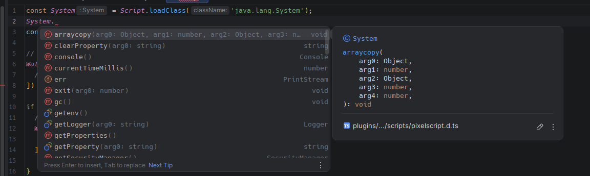

# The `Script` API

Every script has a global `Script` object. It is your handle on the runtime: loading Java classes, pulling
in libraries, and hooking into your own lifecycle.

| Method | Purpose |
|--------|---------|
| `Script.loadClass(className)` | Load a Java class by fully qualified name |
| `Script.addUnloadCallback(callback)` | Run cleanup before this script unloads |
| `Script.getCaller()` | Get the `Script` object of whoever called into you |
| `Script.loadLibrary(relativeJarPath)` | Add a local jar to the runtime classpath |
| `Script.loadGradleDependency(coordinate)` | Download a Maven artifact and add it to the classpath |
| `Script.measure(name, callback)` | Time a block of code and expose it in the profiler |

## `Script.loadClass(className: string): any`

Loads a Java class by its fully qualified name and gives you the JavaScript representation of it. Results
are cached per file, so repeated calls are cheap.

The returned value behaves like a native JS class: call the constructor, read static fields, call static
methods.

```javascript
const ArrayList = Script.loadClass('java.util.ArrayList');
const list = new ArrayList();
list.add('Hello, PixelScript!');
console.log(list.size()); // 1

const System = Script.loadClass('java.lang.System');
const serverType = System.getenv('SERVER_TYPE');

// Enums work exactly as you would expect
const DayOfWeek = Script.loadClass('java.time.DayOfWeek');
console.log(DayOfWeek.MONDAY); // MONDAY
```

Convention is to load classes once at the top of the file and keep them in a `const`:

```javascript
const MiniMessage = Script.loadClass('net.kyori.adventure.text.minimessage.MiniMessage');
const Component = Script.loadClass('net.kyori.adventure.text.Component');
const MM = MiniMessage.miniMessage();

export function mm(message) {
  return MM.deserialize(message);
}
```

### Getting the raw `Class` object

Some Java APIs want a `java.lang.Class` rather than the type itself. Use `.class`:

```javascript
const ArchModule = Script.loadClass('dev.pixelib.pp.core.arch.ArchModule').class;
PPPlugin.getInstance().getModule(ArchModule);
```

### Implementing interfaces inline

Any Java interface loaded this way can be implemented by calling it as a constructor with an object literal.
The runtime generates a real class at runtime that Java code can hold on to.

```javascript
const MyListener = Script.loadClass('com.example.myscheduler.api.MyListener');

const listenerImpl = new MyListener({
  onEvent(event) {
    console.log(`Event received: ${event}`);
  }
});

MySchedulerApi.registerListener(listenerImpl);
```

Functional interfaces such as `Runnable` and `Consumer` are converted automatically, so a plain arrow
function is enough:

```javascript
MySchedulerApi.scheduleTask((currentTime) => {
  console.log(`Current time is: ${currentTime}`);
}, 1000);
```

More on this, including abstract classes, in
[Interfaces and abstract classes](./tips-002-interfaces-and-abstract-classes.md). If you need Java to call
*into* JS through a stable, type-safe handle, see
[Implementing Java interfaces](./spec-014-java-implementations.md) instead.

### Types follow automatically

Whenever a script loads a Java class the runtime has not seen before, `definitions.d.ts` is regenerated to
include it. Your IDE picks it up on the next reload and starts autocompleting the real API.



For simple name lookups without the fully qualified string, see [magic imports](./spec-002-magic-imports.md).

## `Script.addUnloadCallback(callback: () => void): void`

Registers a function to run just before this script is unloaded. This fires on reload, on a parent
unloading, and on server shutdown.

Use it for anything the runtime cannot clean up for you: despawning entities, removing boss bars, closing
inventories, cancelling external subscriptions.

```javascript
const BossBar = Bukkit.createBossBar('Welcome!', $.BarColor.BLUE, $.BarStyle.SEGMENTED_6);

registerListener($.PlayerJoinEvent, (event) => {
  BossBar.addPlayer(event.getPlayer());
});

// Without this, a reload leaves an orphaned boss bar on every player's screen
Script.addUnloadCallback(() => {
  BossBar.removeAll();
  BossBar.setVisible(false);
});
```

You do **not** need to clean up commands, event listeners, or scheduler tasks. Those are unregistered
automatically. See [Commands](./spec-005-commands.md), [Events](./spec-006-events.md) and
[Scheduler](./spec-007-scheduler.md).

## `Script.getCaller(): Script`

Returns the `Script` object of the script that called into the current one. This lets a shared utility
register cleanup in its *caller's* lifecycle rather than its own, which matters because a utility module
outlives any single importer.

```javascript
// utils/entities.js
export function makeHologram(location, text) {
  const entity = spawnDisplay(location, text);

  // Tie the entity to whoever asked for it, not to this module
  Script.getCaller().addUnloadCallback(() => entity.remove());

  return entity;
}
```

Throws if the calling script has multiple instances (which happens with
[`.isolate.js` modules](./spec-003-import-export.md)), because the caller is then ambiguous. Pass the
`Script` object explicitly in that case.

## `Script.loadLibrary(relativeJarPath: string): void`

Loads a jar sitting next to your script into the runtime classpath. The path is relative to the current
script file. The jar is loaded once no matter how many scripts ask for it, and dropped again when they all
unload.

```javascript
Script.loadLibrary('./uni-dialog-core-1.5.0.jar');
Script.loadLibrary('./uni-dialog-paper-1.5.0.jar');
Script.loadLibrary('./uni-dialog-adventure-1.5.0.jar');

export const Dialog = Script.loadClass('io.github.projectunified.unidialog.core.dialog.Dialog');
```

```text
dialogue/
├── dialog.js
├── uni-dialog-adventure-1.5.0.jar
├── uni-dialog-core-1.5.0.jar
└── uni-dialog-paper-1.5.0.jar
```

Classes from a loaded library are added to the type generator too, so they show up in your IDE.

## `Script.loadGradleDependency(coordinate: string): void`

Same idea, but resolved from Maven Central instead of a local file. Takes a Gradle-style coordinate and
caches the download in `plugins/PixelScript/maven_cache`, so it is only fetched once.

```javascript
Script.loadGradleDependency('com.saicone:rtag:1.5.16');
Script.loadGradleDependency('com.saicone:rtag-item:1.5.16');

const RtagItem = Script.loadClass('com.saicone.rtag.RtagItem');
```

Call it at the top of the module that needs it, before the matching `loadClass` calls. Transitive
dependencies are **not** resolved, so list every artifact you need explicitly.

## `Script.measure(name: string, callback: () => void): void`

Runs a callback and records how long it took under `name` in this script's profiler. Useful for finding
the expensive part of a feature.

```javascript
Script.measure('rebuild-scoreboard', () => {
  Bukkit.getOnlinePlayers().forEach(updateScoreboard);
});
```

Read the results with `/script info <file>`. See [Performance profiling](./tips-004-performance-profiling.md).

Exceptions thrown inside the callback are caught and logged rather than propagated, so `measure` never
changes your control flow.
