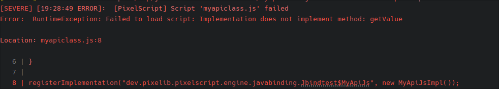

# Implementing Java interfaces

Calling Java from JavaScript is great. Calling JavaScript from Java is normally miserable.

But you do sometimes need it. If a Java plugin has to reach into logic that lives in your scripts, whether
that is an item registry, a permission lookup or a game state query, something has to hand Java a callable
handle. Doing that in a type-safe way used to be genuinely unpleasant.

The **implementation API** makes it neat. You describe the contract once as a Java interface, implement it
in JavaScript, and Java gets a real, typed proxy.

## The three steps

### 1. Describe the API as a Java interface

```java
package com.example;

public interface MyApiJs {
    int getValue(String key);
}
```

This is the contract. It lives in your Java plugin, and both sides are checked against it.

### 2. Implement and register it in JavaScript

```javascript
class MyApiJsImpl {
  getValue(key) {
    return 42;
  }
}

registerImplementation('com.example.MyApiJs', new MyApiJsImpl());
```

`registerImplementation(fullyQualifiedInterfaceName, implementation)` takes the interface's fully qualified
name and any object that has the required methods. A class instance is the usual choice, but a plain object
literal works too:

```javascript
registerImplementation('com.example.MyApiJs', {
  getValue(key) {
    return 42;
  }
});
```

For a nested interface, use the JVM's `$` separator: `'com.example.Outer$MyApiJs'`.

### 3. Use the proxy from Java

```java
import dev.pixelib.pixelscript.api.JS;

MyApiJs api = JS.getImplementation(MyApiJs.class);
int value = api.getValue("thing");
```

`JS` comes from the PixelScript API artifact. See [Download](./getting-started-001-download.md) for the
Maven coordinates.

## Why this is better than the alternatives

### The proxy is never stale

This is the important part. When the script reloads, the proxy automatically forwards calls to the **new**
implementation. Java code that fetched the proxy once at startup keeps working, forever, across any number
of script edits.

That means your Java side never has to think about the script lifecycle. No re-fetching, no listeners, no
null checks after a reload.

### Both sides are validated

If the JavaScript implementation does not satisfy the interface, PixelScript refuses to load the script and
tells you exactly which method is missing:



Validation happens at **registration time**, not at call time. Adding a method to the Java interface and
forgetting to implement it in JS breaks loudly on the next reload, at the line that registered it, rather
than silently at 3am when someone finally calls it.

### It stays type-safe

The Java side deals with a real interface. Autocomplete, refactoring, and the compiler all work normally.
Nothing on that side has any idea it is talking to JavaScript.

## Before a script has registered

`JS.getImplementation()` never returns `null`. If nothing has registered yet, you get a placeholder proxy
that becomes live as soon as a script registers a matching implementation.

Calling a method on the placeholder before it goes live throws. So it is safe to fetch the proxy at plugin
startup and hold on to it, but not safe to call it before your scripts have loaded.

If your plugin needs to be up before scripts run, either defer the first call, or list your plugin in
`config.yml` under `required-plugin-dependencies` so PixelScript waits for you.
See [Configuration](./tutorial-002-configuration.md).

## Fetching from JavaScript too

The same proxy is available inside scripts through the `getImplementation(className)` global. That is
mostly useful for testing your own implementation, or for a script that wants to call an implementation
registered by a different script.

```javascript
const api = getImplementation('com.example.MyApiJs');
log(api.getValue('thing'));
```

## Cleanup

When the registering script unloads, it clears itself from the binding, provided it is still the active
implementation. A later script registering the same interface takes over cleanly, and the previous
registration does not resurrect itself.

## Worked example: an item registry

A common real-world shape. Items are defined in scripts, because that is where they change weekly, but Java
code needs to recognise them.

```java
package dev.pixelib.pp.scripts.api;

import org.bukkit.inventory.ItemStack;

public interface ItemRegistry {
    boolean is(ItemStack itemStack, String id);
    Object getItemById(String id);
}
```

```javascript
// scriptmodule.js
import { DcItem } from '../items/dcitem';
import { getDCItem } from '../items/item_registry';

class JavaItemRegistry {
  is(itemStack, id) {
    if (!itemStack || !id) return false;
    return DcItem.is(itemStack, id);
  }

  getItemById(id) {
    try {
      return getDCItem(id);
    } catch (error) {
      return null;
    }
  }
}

registerImplementation('dev.pixelib.pp.scripts.api.ItemRegistry', new JavaItemRegistry());
```

```java
ItemRegistry registry = JS.getImplementation(ItemRegistry.class);

if (registry.is(event.getItem(), "SYS_DC_KOFFERTJE")) {
    // ...
}
```

The Java plugin now knows nothing about how items are defined, and the script team can add, remove and
restructure items all day without a plugin rebuild.

## When to use something else

- **A Java plugin calls into JS on a schedule or in response to an event**: this API.
- **JS calls into a Java plugin**: just [`Script.loadClass`](./spec-001-script.md), no bridge needed.
- **JS implements a Java interface for a single call, such as a callback argument**: pass an object literal directly. See [Interfaces and abstract classes](./tips-002-interfaces-and-abstract-classes.md).
- **Two scripts need to talk**: [import each other](./spec-003-import-export.md), or use [`GlobalNotification`](./spec-013-shared-state.md).
