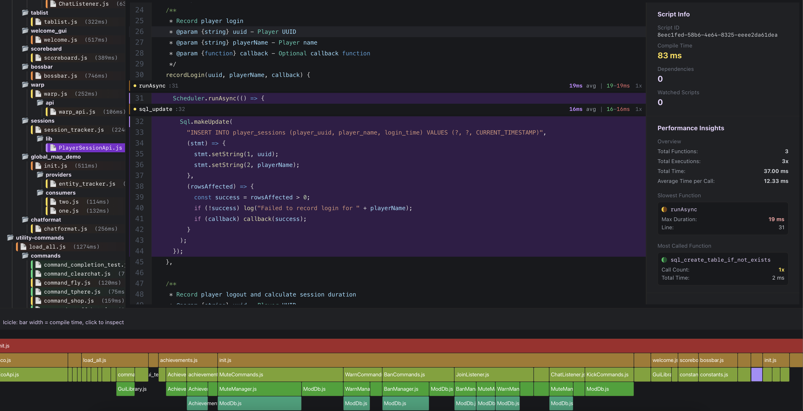
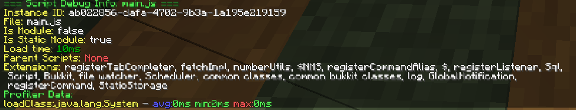

# Performance profiling



Performance matters at scale, and guessing where the time goes is a waste of an afternoon. PixelScript
measures itself.

## What is measured automatically

Timings are collected for every out-of-band invocation the runtime controls:

- Scheduler task executions
- Event listener invocations
- Command invocations
- `Script.loadClass` calls
- `$` magic import resolutions
- Module loads
- `Sql` queries, updates and transactions
- `fetch` calls

Each is recorded per script, with average, shortest and longest durations. Timings are **enabled by
default** because the overhead is tiny and the payoff is not.

## Measuring your own code

Wrap anything you want to see separately with [`Script.measure`](./spec-001-script.md):

```javascript
Script.measure('rebuild-scoreboard', () => {
  Bukkit.getOnlinePlayers().forEach(updateScoreboard);
});
```

It appears in the profiler output under that name. Use this instead of logging timestamps: it costs nothing
when timings are off, and it aggregates over many invocations rather than giving you one sample.

## Reading the results

`/script info <path>` prints the profile for one script, alongside its parents and bound extensions:

```
/script info global/feature/playtime/lib/lib-playtime.js
```



Durations are colour-coded, so a slow entry is obvious at a glance. The columns are average, minimum and
maximum, which matters: a listener averaging 0.2 ms with a 400 ms maximum has an occasional pathological
path that an average alone hides.

## Turning timings off

If you are squeezing the last percent out of a busy server:

```
/script timings disable
/script timings enable
```

Permissions are `pixelscript.profiler.disable` and `pixelscript.profiler.enable`. Disabling clears
collection, so re-enable it before investigating anything.

## Where the time usually goes

In rough order of how often it turns out to be the culprit:

1. **Per-tick timers doing per-player work.** A `runSyncTimer` at period 1 that loops over every online player is 20 times more work per second than one at period 20. Ask whether it really needs to be every tick.
2. **Blocking calls on the main thread.** `Sql` and `fetch` block. If they show up in a main-thread profile at all, they are in the wrong place. See [the concurrency model](./spec-008-threading-model.md).
3. **`$` lookups in hot paths.** Cached after the first hit, but still a map lookup. Hoist them into a `const` at module level. See [magic imports](./spec-002-magic-imports.md).
4. **Reload cascades.** Not a runtime cost, but a development one. `/script tree` shows how much reloads when you touch a shared module.

## Status

The profiler is in beta and its output format may change between releases.
