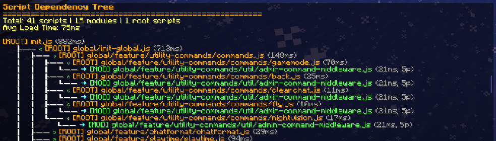
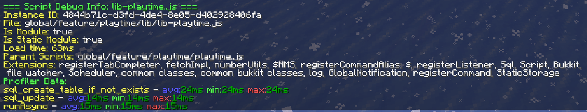
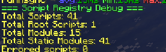

# Built-in commands

Everything lives under `/script`. These commands do not do anything groundbreaking, but they are how you
answer "what is actually loaded right now" without guessing.

| Command | Permission |
|---------|-----------|
| `/script` | none |
| `/script tree` | `pixelscript.debug` |
| `/script info <file>` | `pixelscript.debug` |
| `/script list` | `pixelscript.list` |
| `/script timings <enable\|disable>` | `pixelscript.profiler.enable` / `pixelscript.profiler.disable` |
| `/script registrydebug` | `pixelscript.debug` |
| `/script evalin <file> <code>` | `pixelscript.debug` |

## `/script`

The home screen. Shows the plugin version, the Texel engine version, how many scripts are loaded, and how
long they took to boot.

A good first thing to check after a deploy: if the script count is lower than you expect, something failed
to load.

## `/script tree`

Prints the full dependency hierarchy of every loaded script: who loaded what, and why. This is the command
for understanding your load tree, and for working out why editing one file reloaded eleven others.

Generated asynchronously, so it takes a moment to appear.



## `/script info <file>`

Takes a path relative to the `scripts` directory and prints everything known about that script:

- Its instance ID and whether it is a module
- Its parents, the scripts that caused it to load
- Its extensions, the globals bound into its scope
- Its load time
- Its [profiler data](./tips-004-performance-profiling.md), with average, minimum and maximum durations per measured task

```
/script info global/feature/playtime/lib/lib-playtime.js
```



Tab completion suggests loaded script paths, so you rarely have to type the whole thing.

## `/script list`

Every currently loaded script by path. Quicker than `tree` when you only want to confirm that something is
loaded at all.

## `/script timings <enable|disable>`

Turns profiler collection on or off. Enabled by default. See
[Performance profiling](./tips-004-performance-profiling.md).

## `/script registrydebug`

Counts scripts, root scripts, modules, isolate modules and failed scripts. Semi-internal, mostly useful
when we are helping you diagnose a resolver issue.



## `/script evalin <file> <code>`

Evaluates JS in the scope of an already-loaded script, without editing the script itself. Useful for
manual or agentic debugging: call an individual function or inspect a variable from a script without
touching the file (and without triggering a reload).

```
/script evalin global/features/machines/api/chainable.ts log("hello from chainable!");
```

The `<file>` path is relative to the `scripts` directory, same as `/script info`, and tab completion
suggests loaded script paths.

If `<code>` is a bare variable name, its current value is returned in chat instead of `undefined`.
Anything else is evaluated as a statement/expression and, if it returns a value, that return value is
shown instead.

```
/script evalin global/features/machines/api/chainable.ts machineRegistry
```
