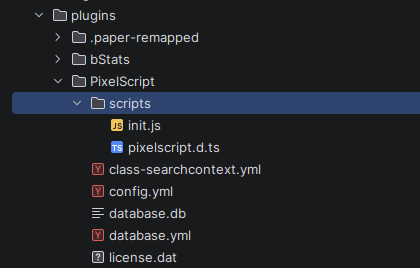

# Setting up your work environment

PixelScript ships in a few flavors. This guide covers the common one: the Paper plugin.

## Prerequisites

Before you start, make sure you have:

- **Solid JavaScript or TypeScript knowledge.** PixelScript uses modern syntax (ES6 and up), and assumes you are comfortable with it.
- **A local Minecraft server.** Paper is recommended, Spigot should work. The [mc cli](https://github.com/mindgamesnl/mc) will spin one up instantly.
- **An IDE.** IntelliJ-based IDEs (IDEA Community/Ultimate, WebStorm) are recommended for their `.d.ts` handling, but VS Code or anything else works.
- **Java 21 or newer.** Builds targeting lower JDK versions are available on request, though they may lack features.
- **A PixelScript jar.** See [Download PixelScript](./getting-started-001-download.md).
- **A cup of tea or coffee.** Optionally with Baileys. We are going to have some fun.

## Install and activate

You are not going to believe this, but you need to install the plugin first.

1. Drop the PixelScript jar into your server's `plugins` folder.
2. Start the server. PixelScript generates its config files, copies the example project, and prints your **hardware ID (HWID)** to the console.
3. Send that HWID to a Pixelib staff member.

That is it. There are no license files to place by hand, and **you do not need to restart**. Once we
activate your HWID, the running plugin picks it up and loads by itself.

> Activation needs an internet connection once. After that your server runs completely offline, and an
> outage on our side will not take your server down.

Once everything is in place, `plugins/PixelScript` should look like this:



The important entries:

| Path | What it is |
|------|------------|
| `scripts/` | Your codebase. Everything you write lives here. |
| `scripts/definitions.d.ts` | Generated types for every Java class your scripts touch. Never edit by hand. |
| `scripts/tsconfig.json` | Wires up the generated types and the `@/` path alias. |
| `config.yml` | Plugin load order. See [Configuration](./tutorial-002-configuration.md). |
| `database.yml` | The [Sql module](./spec-009-database.md) connection settings. |
| `class-searchcontext.yml` | Packages searched by the [`$` resolver](./spec-002-magic-imports.md). |
| `maven_cache/` | Jars pulled in by `Script.loadGradleDependency()`. |

On first boot the plugin copies a working example project into `scripts/`. It is only copied when the
folder does not exist yet, so it will never overwrite your work. Read it. It is the fastest way to learn the idioms.

## Set up your repository

PixelScript codebases tend to be monolithic: every server in your network shares one set of scripts, and
the environment decides which ones are active. That makes a single repository the natural unit.

Initialise a git repository in `plugins/PixelScript/scripts` and you are set:

```bash
cd plugins/PixelScript/scripts
git init
```

Make sure `definitions.d.ts` is in your `.gitignore`. It is regenerated on every boot and on every new
class your scripts touch, so committing it just produces noise:

```gitignore
definitions.d.ts
```

Details on laying out the code are in [Scripts and script management](./tutorial-003-scripts.md).

## Develop locally, not over SSH

Hot reloading is great, but an environment that works with you is better.

Working directly on a remote server is the fastest way to get started and the slowest way to keep going.
PixelScript continuously regenerates `definitions.d.ts` as your scripts touch new Java classes. If you edit
over SFTP, your IDE uploads your changes but does not pull the regenerated definitions back down, so your
autocomplete quietly goes stale.

Run a local server instead. Your IDE picks up every regeneration immediately, and you get accurate
completions for the exact Bukkit version you are targeting.

A nice habit: open the `plugins/PixelScript` folder itself as your IDE workspace, so everything related to
PixelScript lives in one project.

## Next up

[Configuration](./tutorial-002-configuration.md).
