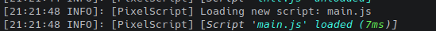
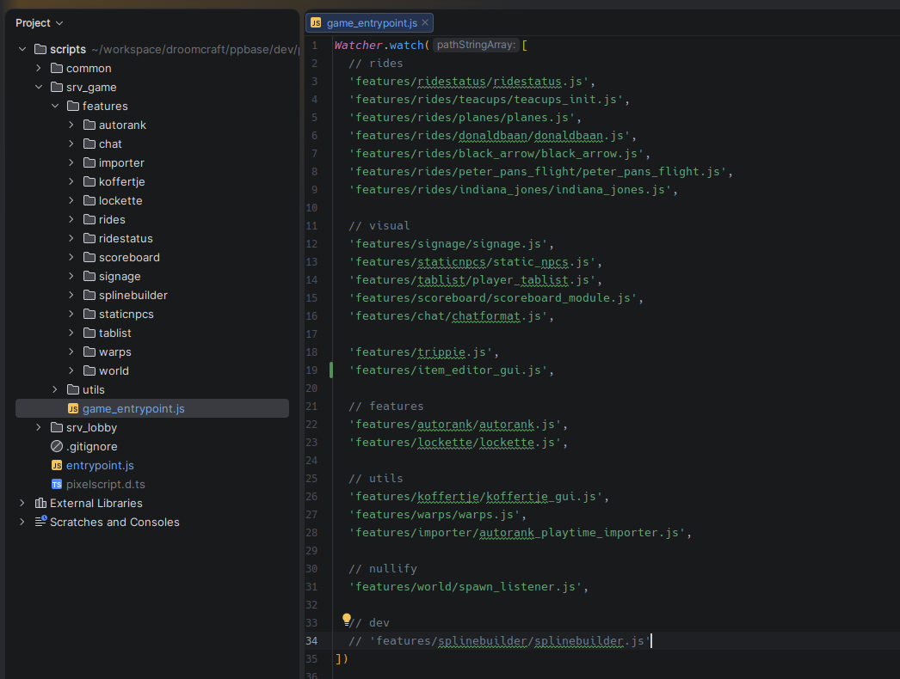

# Scripts and script management

Everything lives under `plugins/PixelScript/scripts`. Every path in this article is relative to that folder.

This is the single most important article in the documentation. Once the load tree clicks, the rest of
PixelScript is just the Bukkit API.

## The three kinds of script

Every loaded script is in exactly one of three roles. The role decides when it loads, when it reloads, and
what it drags along with it.

### Root scripts

Any `.js` or `.ts` file directly in the `scripts` folder is a **root script**. They are all loaded
automatically when the plugin boots and its dependencies are ready, in an **undefined order**.

Reserve this level for your main entrypoint, plus the occasional hotfix that must be live *now* in
production without waiting on anything else.

### Watched scripts

A script becomes **watched** when a parent explicitly asks for it with `Watcher.watch()`. Watched scripts
are the barriers in your reload tree, which makes them the right tool for features and subsystems.

- When the parent unloads, the watched script unloads with it.
- When the parent **reloads**, the watched script does **not** reload. It is a barrier. This is what stops a tweak to your entrypoint from rebooting your whole server's logic.
- When the watched script itself is edited, it reloads, along with any children that have no other active parent.
- When a script stops being watched (you deleted the line and saved), it is unloaded, taking its children with it. That is how you disable an entire subsystem on the fly.

### Imported scripts

A script becomes **imported** when another script `import`s something from it. Imported scripts are modules:
they load on demand and unload when nobody needs them anymore.

- Editing an imported script reloads it **and every script that imports it**, and their children.
- **Be careful with this.** A small change in a widely imported utility can cascade into a massive reload. Your dev server will not be the first to fall to the mighty reload cascade.
- An imported script has exactly **one instance** at runtime. Two scripts importing the same module share it, including its module-level state. That makes `export const someSingleton = new Thing()` a genuine singleton.
- It is only unloaded once **all** importers are gone.

If you need a fresh instance per importer, name the file `something.isolate.js`. Isolate modules are the
exception to the single-instance rule and are re-evaluated for every script that imports them.

Full details on module syntax and path resolution are in [import and export](./spec-003-import-export.md).

## Watchers in practice

`Watcher.watch()` takes a path, or an array of paths, **relative to the directory of the script calling it**.
Not relative to the `scripts` root. This is the single most common thing people get wrong.

```javascript
// scripts/global/init-global.js
Watcher.watch([
  'feature/chatformat/chatformat.js',   // resolves to scripts/global/feature/chatformat/chatformat.js
  'feature/playtime/playtime.js',
  'feature/punishments/init.js',
])
```

Two rules that follow from how watching is committed:

1. **Call `Watcher.watch()` during initial evaluation, at the top level of your script.** The watch list is committed exactly once, right after the script finishes evaluating. A call made later (inside an event listener, a scheduler callback, a command handler) is silently ignored.
2. **One script can call it multiple times.** Every call before the commit adds to the same list, so grouping related watches into separate calls is purely cosmetic.

## Building your entrypoint

Let's build a server called *PSCraft*. It will eventually be several servers sharing one codebase, with an
environment variable deciding which modules each one runs.

Create `main.js` in the `scripts` folder. Save it, and you should see it load:



Now give it something to do:

```javascript
const System = Script.loadClass('java.lang.System');
const serverType = System.getenv("PSCRAFT_SERVER_TYPE") || "lobby";

// Common modules, loaded on every server type
Watcher.watch([
  'common/init-common.js'
]);

switch (serverType) {
  case "lobby":
    Watcher.watch('servers/lobby/init-lobby.js');
    break;

  case "minigames":
    Watcher.watch('servers/minigames/init-minigames.js');
    break;

  default:
    console.warn(`Unknown PSCRAFT_SERVER_TYPE "${serverType}". This server is not configured correctly.`);
    Bukkit.shutdown();
    break;
}
```

> `Script.loadClass` pulls in any Java class by fully qualified name. See [the Script API](./spec-001-script.md).

Each `init-*.js` file is itself just a list of watches, which gives you a tree of barriers. A change deep in
one feature never disturbs the rest.

```javascript
// scripts/common/init-common.js
Watcher.watch([
  'commands/gamemode.js',
  'commands/fly.js',
  'chat/chatformat.js',
]);
```

## Project layout

PixelScript projects work best as a monolith: every server in the network runs the same codebase, and the
environment decides which parts are active. You get shared utilities, shared commands, and one place to fix
a bug.

A layout that holds up well:

```text
scripts/
├── main.js                          # root entrypoint, branches on server type
├── config/
│   └── constants.js                 # exported constants, imported everywhere
├── common/
│   ├── init-common.js               # watches everything below
│   ├── commands/
│   ├── chat/
│   └── utils/                       # imported modules, not watched
└── servers/
    ├── lobby/
    │   ├── init-lobby.js
    │   └── feature/
    └── minigames/
        ├── init-minigames.js
        └── feature/
```

Here is how a real production codebase organises the same idea:



The rule of thumb:

- **Features get watched.** They register commands and listeners and export nothing anyone needs.
- **Utilities get imported.** They export functions and singletons and register nothing.

Mixing the two is what produces surprise reload cascades.

## Your first module

Take the command from [the Commands article](./spec-005-commands.md) and drop it in
`common/commands/gamemode.js`. Then watch it from `common/init-common.js`:

```javascript
Watcher.watch([
  'commands/gamemode.js'
]);
```

Save, and the command is live. Because it is watched rather than imported, you can now edit `main.js` all
day without ever touching the gamemode command, and you can edit the gamemode command without touching
anything else.

## Inspecting the tree

When the tree gets big, let the server draw it for you:

- `/script tree` prints the full dependency hierarchy: who loaded what, and why.
- `/script info <file>` shows one script's parents, its bound extensions, and its profiler data.

Both are covered in [built-in commands](./tips-005-built-in-commands.md).

## Next up

You now know how code gets loaded. Time for the APIs it can call:
[the Script API](./spec-001-script.md).
